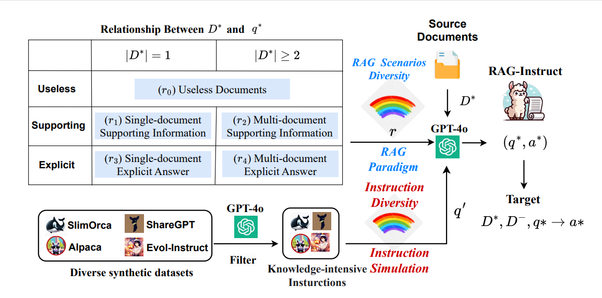

# RAG-Instruct: Boosting LLMs with Diverse Retrieval-Augmented Instructions
<div align="center">
<h3>
  RAG-Instruct
</h3>
</div>

<p align="center">
📃 <a href="assets/paper.pdf" target="_blank">Paper</a> ｜🤗 <a href="https://huggingface.co/FreedomIntelligence/RAG-Instruct-Llama3-3B" target="_blank">RAG-Instruct-Llama3-3B</a> ｜🤗 <a href="https://huggingface.co/FreedomIntelligence/RAG-Instruct-Llama3-8B" target="_blank">RAG-Instruct-Llama3-8B</a> ｜  📚 <a href="https://huggingface.co/datasets/FreedomIntelligence/RAG-Instruct" target="_blank">RAG-Instruct Dataset</a>
</p>


## ⚡ Introduction
Hello! Welcome to the repository for [RAG-Instruct](https://arxiv.org/abs/2501.00353)!

<div align=center>

</div>


**RAG-Instruct** is a method for generating diverse and high-quality RAG instruction data. It synthesizes instruction datasets based on any source corpus, leveraging the following approaches:

- **Five RAG paradigms**, which represent diverse query-document relationships to enhance model generalization across tasks.
- **Instruction simulation**, which enriches instruction diversity and quality by utilizing the strengths of existing instruction datasets.

Using this approach, we constructed a 40K instruction dataset from Wikipedia, covering a wide range of RAG scenarios and tasks.

We open-sourced our models, data, and code here.

<!-- ## 💭 Environment
You can create a conda environment by running the command below.
```
pip install -r requirements.txt
``` -->

## 💻 Model
- **Model Access**

|          Model Name                  | Base LLMs       | Link                                                                         |
| -------------------------- | ------------ | ---------------------------------------------------------------------------- |
| **RAG-Instruct-Llama3-3B** | LLaMA-3.2-3B | [HF Link](https://huggingface.co/FreedomIntelligence/RAG-Instruct-Llama3-3B) |
| **RAG-Instruct-Llama3-8B** | LLaMA-3.1-8B | [HF Link](https://huggingface.co/FreedomIntelligence/RAG-Instruct-Llama3-8B) |


- **Deploy**

RAG-Instruct models can be used just like `Llama-3.1-8B-Instruct`. You can deploy it with tools like [vllm](https://github.com/vllm-project/vllm) or [Sglang](https://github.com/sgl-project/sglang),  or perform direct inference:
```python
from transformers import AutoModelForCausalLM, AutoTokenizer

# Load the model and tokenizer
model = AutoModelForCausalLM.from_pretrained("FreedomIntelligence/RAG-Instruct-Llama3-8B",torch_dtype="auto",device_map="auto")
tokenizer = AutoTokenizer.from_pretrained("FreedomIntelligence/RAG-Instruct-Llama3-8B")

# Example input
input_text = """### Paragraph:
[1] structure is at risk from new development...
[2] as Customs and Excise stores...
[3] Powis Street is partly underway...
...

### Instruction:
Which organization is currently using a building in Woolwich that holds historical importance?
"""

# Tokenize and prepare input
messages = [{"role": "user", "content": input_text}]
inputs = tokenizer(tokenizer.apply_chat_template(messages, tokenize=False,add_generation_prompt=True), return_tensors="pt").to(model.device)

# Generate output
outputs = model.generate(**inputs, max_new_tokens=2048)
print(tokenizer.decode(outputs[0], skip_special_tokens=True))
```


## 📚 Data
We’ve open-sourced a 40K instruction dataset for RAG. Download it here:

| Data                  | Description                                                                                   | Link                                                                                           |
| -------------------------- | ----------------------------------------------------------------- | --------------------------------------------------------------------------------------------- |
| RAG-Instruct (Wikipedia) | Diverse RAG instruction data based on Wikipedia | [Link](https://huggingface.co/datasets/FreedomIntelligence/RAG-Instruct)  |

## 🚀 Training

### **Fine-tuning with RAG-Instruct**

You can fine-tune your large model using the `RAG-Instruct` dataset to significantly boost RAG capabilities. Use the following code:

```bash
accelerate launch --config_file ./configs/sft.yaml \
    --num_processes 8  \
    --num_machines 1 \
    --machine_rank 0 \
    --deepspeed_multinode_launcher standard train_rag_sft.py \
    --experiment_name RAG-Instruct-training \
    --model_path meta-llama/Llama-3.1-8B-Instruct \
    --data_path FreedomIntelligence/RAG-Instruct \
    --max_seq_len 4096 \
    --learning_rate 5e-6 \
    --train_bsz_per_gpu 1 \
    --gradient_accumulation_steps 16 \
    --output_dir ./ckpts \
    --log_dir ./train_logs \
    --n_epochs 3 \
    --gradient_checkpointing
```

## 🛠️ Data Construction

We provide scripts to **synthesize a diverse RAG instruction dataset**.

**1. Download Source Documents.**  
We use preprocessed passage data from DPR and embeddings generated with [Contriever-MSMARCO](https://github.com/facebookresearch/contriever) :

- Download the preprocessed passage data:
  ```bash
  cd retrieval_lm
  wget https://dl.fbaipublicfiles.com/dpr/wikipedia_split/psgs_w100.tsv.gz
  ```
  
- Download the generated embeddings:
  ```bash
  wget https://dl.fbaipublicfiles.com/contriever/embeddings/contriever-msmarco/wikipedia_embeddings.tar
  ```

**2. Prepare Exemplar Datasets.**  

We utilize several high-quality datasets as exemplars, including [ShareGPT](https://huggingface.co/datasets/anon8231489123/ShareGPT_Vicuna_unfiltered), [Alpaca](https://github.com/tatsu-lab/stanford_alpaca), [WizardLM-70K](https://huggingface.co/datasets/WizardLM/WizardLM_evol_instruct_V70K), [Lmsys-chat-1M](https://huggingface.co/datasets/lmsys/lmsys-chat-1m), and [SlimOrca](https://huggingface.co/datasets/Open-Orca/OpenOrca).

To ensure high-quality data, we filtered and sampled these datasets using GPT-4 to extract **knowledge-intensive data** (Q).

**3. Retrieve Documents.**  
We use preprocessed passage data from DPR and embeddings generated with [Contriever](https://github.com/facebookresearch/contriever). To retrieve passages, use the following command:

```bash
cd retrieval_lm
python passage_retrieval.py \
    --model_name_or_path facebook/contriever-msmarco \
    --passages psgs_w100.tsv \
    --passages_embeddings "wikipedia_embeddings/*" \
    --input_name RAG_INSTRCT_DATA_PATH \
    --output_dir YOUR_OUTPUT_FILE \
    --n_docs 250
```

The input file must be in `json` or `jsonl` format. Each instance should include either a `question` or `instruction` field, which will be used as the query during retrieval.

Using the exemplar data (Q), we retrieve source documents to construct (D*). Specifically, we match the exemplar instructions or questions with source documents by ranking their relevance. For convenience, we provide a processed dataset containing source documents and exemplar data across five RAG scenarios [here](data_gen/examplar_data/data.json).

**4. Synthesize Data with Prompts.**  
Using the retrieved documents (D*) and exemplar data (Q), we synthesize new data points with tailored prompts to create diverse and high-quality instruction-following datasets.

```bash
cd data_gen
python generate_data.py \
    --data_path examplar_data/data.json \
    --max_workers 16 \
    --save_dir ./output_data/RAG-Instruct.json
```


## 🔥 Evaluation


## 📖 Citation
```
@misc{liu2024raginstructboostingllmsdiverse,
      title={RAG-Instruct: Boosting LLMs with Diverse Retrieval-Augmented Instructions}, 
      author={Wanlong Liu and Junying Chen and Ke Ji and Li Zhou and Wenyu Chen and Benyou Wang},
      year={2024},
      eprint={2501.00353},
      archivePrefix={arXiv},
      primaryClass={cs.CL},
      url={https://arxiv.org/abs/2501.00353}, 
}
```
